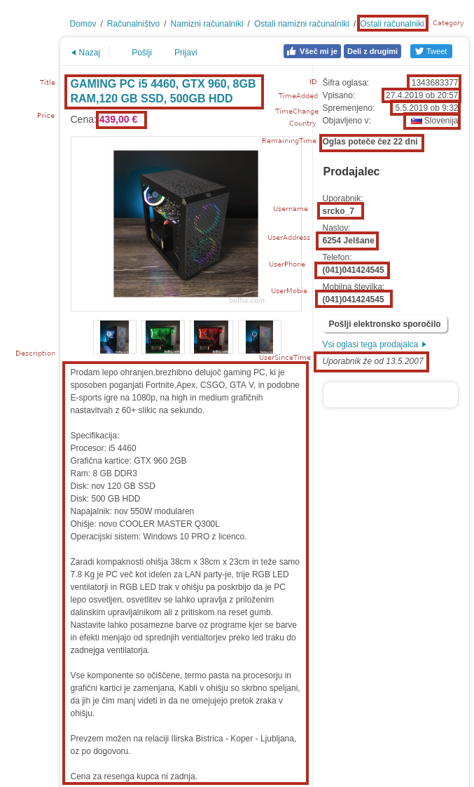
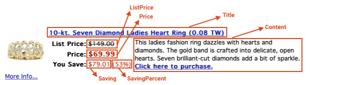

# HTML data extraction

Extract data from webpage samples of differet types using three different methods:

* regular expressions,
* XPath,
* RoadRunner-like implementation.

## Webpage types
### bolha.com

### rtvslo.si

### overstock.com

## Repository structure
Main code resides within [data_extraction.py](code/data_extraction.py) file.

Directory [data/extracted_data/](data/extracted_data/) holds .json files containg structured data extracted from sample web pages.

Sample web pages are located within:

* [data/pages/bolha/](data/pages/bolha/) directory
* [data/pages/overstock.com/](data/pages/bolha/) directory
* [data/pages/rtvslo.si/](data/pages/bolha/) directory

## Installation 
### Prerequisites
Python 3.6/3.7 (tested on linux - Ubuntu 18.04)
Packages used:

* lxml
* re
* json

## Running
Run [data_extraction.py](code/data_extraction.py)

Three methods were implemented to handle data extraction using Regular expressions or XPath:

* __extract_data_bolha__
* __extract_data_rtvslo__
* __extract_data_overstock__

Each of three methods accepts two input parameters:

* __document__
* __method__ (possible values: '_xpath_' or '_regex_')

## License

This project is licensed under the MIT License - see the [LICENSE.md](LICENSE.md) file for details
